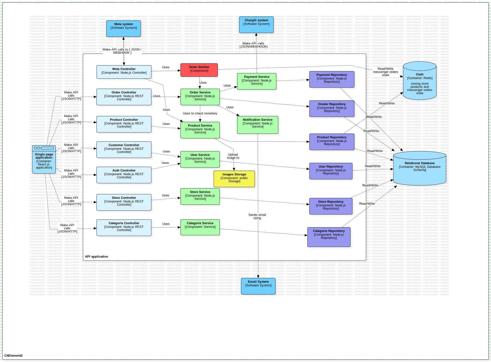

# Complete Ecommerce System Specification 
# Requirement gathering and understanding :

## 1. System Actors

 1.1 Vendor
 1.2 Customer
### 1.3 External Systems
- Chargili API (Payments)
- Meta API (Messenger)

## 2. Functional Requirements

### 2.1 Vendor Functions

#### Store Management
- Create and manage store
- Register and log in
- Setup payouts and Meta integration

#### Product Management
- Add, edit, delete products
- Set prices, manage inventory, upload images

#### Category Management
- Create and organize categories
- Edit category structure

#### Order Management
- View, process, and update orders
- Handle website and Messenger orders
- View history, generate reports

### 2.2 Customer Functions

#### Website Shopping
- Browse, search, and view products
- Manage cart and place orders
- Choose payment:
  - Cash on delivery
  - Baridimob
- Get order confirmations

#### Messenger Shopping
- Browse and order products via Messenger
- Use cash on delivery
- Get confirmations and updates

### 2.3 System Functions

#### Payment Processing
- Integrate Chargili API
- Process payments and refunds
- Manage cash on delivery orders

#### Meta Integration
- Connect Messenger
- Handle messages and orders
- Send responses and updates

#### Order Processing
- Validate info, track status
- Send notifications, update inventory
- Generate invoices

## 2. Non-Functional Requirements

### 2.1 Performance
- System shall load product pages within 3 seconds
- System shall handle at least 1000 concurrent users
- System shall process payment transactions within 5 seconds

### 2.2 Security
- System shall encrypt all sensitive data in transit and at rest
- System shall implement rate limiting for API endpoints

### 2.3 Usability
- System shall be accessible on mobile and desktop devices
- System interface shall be intuitive and user-friendly
- System shall provide clear error messages and feedback

### 2.4 Scalability
- System shall implement caching mechanisms

### 2.6 Maintainability
- System shall follow tier architecture
- System shall maintain comprehensive documentation
- System shall support version control for content

### 3. Use Cases Diagram : 

### 4. Activity Diagram : 

# System Design : 

#  System Components :

## Backend Components

## Full Database Schema
## Entity-Relationship Diagram :

