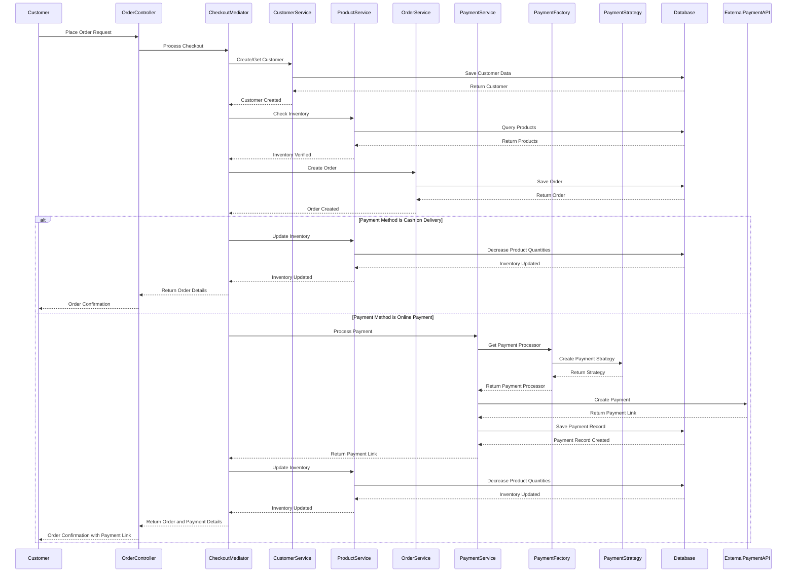

# C4 Sequence Diagram - Checkout Process

```mermaid
sequenceDiagram
    participant Customer
    participant OrderController
    participant CheckoutMediator
    participant CustomerService
    participant ProductService
    participant OrderService
    participant PaymentService
    participant PaymentFactory
    participant PaymentStrategy
    participant Database
    participant ExternalPaymentAPI
    
    Customer->>OrderController: Place Order Request
    OrderController->>CheckoutMediator: Process Checkout
    
    CheckoutMediator->>CustomerService: Create/Get Customer
    CustomerService->>Database: Save Customer Data
    Database-->>CustomerService: Return Customer
    CustomerService-->>CheckoutMediator: Customer Created
    
    CheckoutMediator->>ProductService: Check Inventory
    ProductService->>Database: Query Products
    Database-->>ProductService: Return Products
    ProductService-->>CheckoutMediator: Inventory Verified
    
    CheckoutMediator->>OrderService: Create Order
    OrderService->>Database: Save Order
    Database-->>OrderService: Return Order
    OrderService-->>CheckoutMediator: Order Created
    
    alt Payment Method is Cash on Delivery
        CheckoutMediator->>ProductService: Update Inventory
        ProductService->>Database: Decrease Product Quantities
        Database-->>ProductService: Inventory Updated
        ProductService-->>CheckoutMediator: Inventory Updated
        CheckoutMediator-->>OrderController: Return Order Details
        OrderController-->>Customer: Order Confirmation
    else Payment Method is Online Payment
        CheckoutMediator->>PaymentService: Process Payment
        PaymentService->>PaymentFactory: Get Payment Processor
        PaymentFactory->>PaymentStrategy: Create Payment Strategy
        PaymentStrategy-->>PaymentFactory: Return Strategy
        PaymentFactory-->>PaymentService: Return Payment Processor
        
        PaymentService->>ExternalPaymentAPI: Create Payment
        ExternalPaymentAPI-->>PaymentService: Return Payment Link
        
        PaymentService->>Database: Save Payment Record
        Database-->>PaymentService: Payment Record Created
        
        PaymentService-->>CheckoutMediator: Return Payment Link
        CheckoutMediator->>ProductService: Update Inventory
        ProductService->>Database: Decrease Product Quantities
        Database-->>ProductService: Inventory Updated
        ProductService-->>CheckoutMediator: Inventory Updated
        
        CheckoutMediator-->>OrderController: Return Order and Payment Details
        OrderController-->>Customer: Order Confirmation with Payment Link
    end
```

This sequence diagram illustrates the checkout process flow in the E-commerce Platform, showing how different components interact during order placement.
